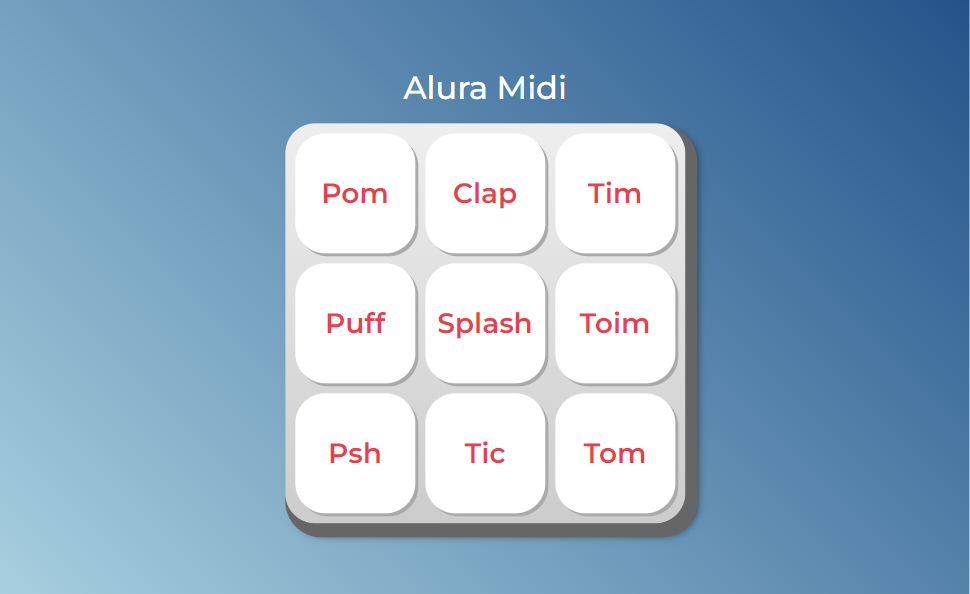

# Alura MIDI

> Alura MIDI

Projeto construído durante o curso JavaScript para Web: Crie páginas dinâmicas, ministrado pela Alura.

[Clique aqui para acessar](https://paulomarquesdev.github.io/alura-midi/)

## Tecnologias

- HTML e CSS
- JavaScript

## 💻 Projeto

O Alura MIDI é uma página de MIDI Pad com botões que reproduzem sons de instrumentos. A página foi desenvolvida aplicando JavaScript para ligar o click dos butões e a reprodução dos sons.
